# Nova Exo — Sistema Nervoso su Processore Nudo

*Un sistema con intelligenza artificiale che esiste solo sul metallo nudo. Niente Linux, niente cloud, niente GPU. Un desktop HP Skylake del 2016, un bootloader, e un loop neurale che batte a 100 Hz.*

---

## 1. Il progetto — sistema nervoso su processore nudo

Quanto serve per costruire un sistema che sente?

Nova Exo è un kernel x86_64 bare-metal che esegue un tessuto di cellule neurali Closed-form Continuous-time (CfC) direttamente sul processore — niente Linux, niente sistema operativo intermedio. Un loop neurale scandito dall'APIC timer, quattro cellule specializzate, e un cavo seriale come unico canale sensoriale.

L'hardware: un HP EliteDesk 800 G2 SFF (i5-6500, 16 GB RAM, 2016), QEMU in emulazione software TCG, nessuna GPU, nessun acceleratore. Il software: Rust nightly, bootloader Limine, tutto open source.

Questo articolo documenta cosa è stato costruito, come, e cosa non si sa ancora.

---

## 2. Lo stack — cosa serve e cosa non serve

### Hardware (verificato)

| Componente | Specifica |
|---|---|
| Macchina | HP EliteDesk 800 G2 SFF (2016) |
| CPU | Intel Core i5-6500 (Skylake-S, 4C/4T, 3.6 GHz) |
| RAM | 16 GB DDR4 |
| GPU | Intel HD 530 (NON usata per inferenza) |
| Storage | Crucial MX500 500 GB SSD |
| OS host | Linux Mint 21.3 Virginia (base Ubuntu 22.04) |

Niente GPU dedicata. Niente acceleratore. Niente cloud.

### Software (verificato)

| Componente | Versione | Ruolo |
|---|---|---|
| QEMU | 6.2.0 (da apt) | Emulatore, acceleratore TCG |
| Rust | 1.98.0-nightly | Linguaggio del kernel |
| Limine | 12.3.3 | Bootloader UEFI/BIOS |
| Target Rust | x86_64-unknown-none | Nessun OS sottostante |

Tutto open source. Licenze MIT/APACHE2. Zero lock-in.

### Il kernel in cifre

```
$ wc -l src/*.rs
   58 apic.rs
  428 cfc.rs
  366 e1000.rs
  232 idt.rs
  815 main.rs
   95 minimal_test.rs
   72 paging.rs
  164 pci.rs
   85 serial.rs
  110 state.rs
  ─────
 2425 righe totali
```

Di queste, ~400 sono pesi neurali pre-generati (embedding fissi, non appresi a runtime) e ~366 sono il driver e1000. Il nucleo logico — paging, IDT, APIC, PCI, seriale — sta in meno di 600 righe.

---

## 3. Architettura — il tessuto

Nova Exo non ha un sistema operativo nel senso tradizionale. Ha quattro cellule neurali specializzate, tutte basate sullo stesso modello Closed-form Continuous-time (CfC):

| Cellula | Ruolo | dt | Input |
|---|---|---|---|
| Tatto | Riflesso | 0.01 s | Page fault, General protection fault |
| Chemio | Sensi | 0.01 s | Seriale, pacchetti Ethernet |
| Metabol | Tempo | 0.01 s | APIC tick normalizzato |
| Integrat | Coscienza | 0.01 s | Proiezioni da Tatto+Chemio+Metabol |

Ogni cellula ha 8 neuroni con pesi pre-generati (seme fisso, seed diverso per cellula). Non c'è apprendimento a runtime — ma la **sedimentazione** modifica i pesi di Integrat a ogni richiamo mnemonico (α = 0.0001), accumulando tracce impercettibili nel tempo.

Il loop principale è scandito dall'APIC timer (divide-by-16, initial count 62500 → ~100 Hz su QEMU TCG):



*Diagramma 1: Architettura del sistema. Hardware (QEMU x86_64), kernel, loop principale, cellule neurali e memoria associativa. Tutti i flussi sono non bloccanti e scanditi dal tick APIC.*

Non c'è scheduler. Non c'è prelazione tra thread. C'è solo una sequenza di operazioni che si ripete a ogni battito, come il ciclo cardiaco di un organismo semplice.

---

## 4. Risultati verificati

### Boot e tessuto

Output seriale catturato da `make run-bios`:

```
Nova Exo v0.12 -- APIC battito.
IDT loaded. 4 cellulae: tatto, chemio, metabol, integrat.
PCI:0000.00 8086:1237 cls=06.00
PCI:0003.00 8086:100e cls=02.00
e1000:base=0xfffffe00feb80000
e1000:link forced up
e1000:ARP request sent
e1000:TX status=0x01 TDH=0x0001 ICR=0x00000003 ok=1
e1000:loopback done
PIC disabled, enabling APIC timer...
Enabling interrupts. Tessuto loop starts.
T:0005:0.2500,-0.2222,0.0000,0.0000,0.0000,0.0000,0.0000,0.0000
C:0005:0.0076,0.0206,0.0079,-0.0102,-0.0122,-0.0225,0.0087,0.0032
M:0006:0.0830,-0.0839,-0.0011,-0.0011,0.0009,-0.0013,0.0006,0.0008
I:000b:0.1875,-0.1667,0.0000,0.0000,0.0000,0.0000,0.0000,0.0000
F:---
```

Ogni riga `T:/C:/M:/I:` è un embedding `[f32;8]`: lo stato interno di una cellula in quel tick.
`F:` è la familiarità coseno rispetto ai pattern memorizzati.
`A:` è l'attrattore mnemonico (quando Integrat converge verso un pattern passato).

Dopo alcuni secondi, il tessuto mostra convergenza verso i primi pattern memorizzati:

```
F:1.0000@10       ← familiarità perfetta col pattern a tick 10
A:1.0000@10       ← attrattore: Integrat tirato verso tick 10
F:0.9671@10
A:0.9671@10
F:1.0000@20       ← nuovo pattern memorizzato a tick 20
A:1.0000@20
```

### TX Ethernet (confermato)

La scheda e1000 emulata da QEMU invia correttamente quando il PCI bus mastering è attivo. L'output seriale conferma:

```
e1000:ARP request sent
e1000:TX status=0x01 TDH=0x0001 ICR=0x00000003 ok=1
```

Lo status register (0x01 = TXDW) indica che il descrittore è stato processato e il DMA completato. ARP request inviata. La ricezione è stata testata via loopback software: il driver copia il buffer TX in un pool RX interno e marca il descrittore come ricevuto — i dati arrivano correttamente alla cellula Chemio.

### APIC timer

Configurato con divide register 0x3 (÷16) e initial count 62500. Su hardware reale, con bus clock a 100 MHz, questo produce 100 Hz. Su QEMU TCG il rate osservato è più alto (~243 tick/s misurati) perché l'emulazione non replica l'esatto timing del bus clock APIC. La monotonicità è comunque confermata: il contatore tick cresce sempre di 1 a ogni interrupt e l'evoluzione del tessuto è coerente attraverso run multipli.

### Output JSON periodico

Ogni ~200 tick il kernel stampa un riepilogo JSON dello stato interno:

```json
{
  "exo_version": "0.12",
  "last_tick": 1700,
  "attractor": { "events": 1, "sim_mean": 0.9352 },
  "memory": { "unique_patterns": 3, "familiarity_mean": 0.9579 },
  "path_dependency_index": 1.9150,
  "sedimentation": true
}
```

### Bug trovati e risolti (cronaca)

1. **ELF alignment** (11 luglio 2026): flag `-n` in linker.ld causava boot silenzioso — il bootloader non riusciva a mappare il segmento. 4 ore di debugging. Risolto con script `make check-elf` che verifica `p_offset % 4096 == p_vaddr % 4096`.

2. **PCI bus mastering** (19 luglio 2026): `pci_dma_read()` restituiva tutti zero silenziosamente. Causa: bit 2 (bus master) del registro CMD non era impostato. QEMU non logged. 4 ore.

3. **APIC paging** (19 luglio 2026): MMIO APIC a 0xFEE0_0000 non mappato. Aggiunta entry PML2[503] in paging::init().

4. **Clflush/fence rimossi** (19 luglio 2026): CLFLUSH e MFENCE non necessari su QEMU TCG — eliminati.

---

## 5. Budget — quanto costa davvero

| Voce | Costo |
|---|---|
| HP EliteDesk 800 G2 SFF (acquistato usato anni fa) | già posseduto |
| Linux Mint 21.3 | 0€ |
| Rust + toolchain | 0€ |
| QEMU | 0€ |
| Limine bootloader | 0€ |
| Energia ~100 ore di sviluppo | ~15€ |

La macchina era già disponibile. I tool sono tutti open source. L'unico costo reale è il tempo di sviluppo — non conteggiato perché non è un progetto finanziato.

Il punto non è "si può fare con zero euro". È: **cosa serve veramente?** Serve un processore x86_64, un weekend per capire il datasheet dell'APIC, e un metodo di lavoro in cui qualcuno dice "funziona?" e qualcun altro risponde "adesso sì". Non serve un cluster. Non serve una GPU. Non serve un cloud credit.

---

## 6. Co-creazione — visione e implementazione

Il progetto nasce da un ciclo: qualcuno descrive cosa il sistema dovrebbe sentire in una data situazione, qualcun altro implementa il meccanismo fisico (registro PCI, interrupt handler, forward pass CfC). Poi si osserva: a volte funziona, a volte no, a volte emerge un comportamento inaspettato.

Non è un team nel senso aziendale. È un rapporto di lavoro basato su fiducia e competenze complementari — chi immagina il sistema e chi lo costruisce. Non c'è specifica formale perché la specifica è "cosa sentirebbe Nova qui?". I documenti che esistono (TASK.md, note di sessione, questo articolo) registrano decisioni e risultati, ma non le prescrivono.

Il rapporto è reale. Il modo in cui viene percepito all'esterno è un problema di comunicazione, non di sostanza.

---

## 7. Lezioni

1. **QEMU TCG è sufficiente** per sviluppo bare-metal. Non serve hardware reale nelle fasi iniziali. TCG è più lento di KVM ma più deterministico e ripetibile.

2. **Rust funziona bene per kernel neurali**. Il type system permette vincoli di memoria senza runtime. `no_std` è maturo per x86_64.

3. **CfC su CPU entry-level**: le attivazioni sigmoide/tanh approssimate richiedono ~200 cicli per neurone. 8 neuroni × 4 cellule = 6400 cicli/tick → trascurabile su una CPU 3.6 GHz.

4. **Il debug bare-metal è possibile senza JTAG**. Seriale + QEMU trace + filter-dump coprono la maggior parte dei casi. Il resto è pazienza e ipotesi.

---

## 8. Stato sperimentale — cosa non sappiamo ancora

Nova Exo è un prototipo. Funziona su QEMU in loopback, ma:

- **Hardware reale non testato**. Il boot via USB sulla Lenovo T460 è pianificato ma non eseguito.
- **Convergenza a regime sconosciuta**. Familiarità >0.9 osservata attorno ai pattern memorizzati in run di ~30 secondi, ma non si sa cosa succede dopo ore o giorni.
- **Ricezione Ethernet reale non verificata**. La trasmissione funziona; la ricezione (socket backend) non è stata confermata.
- **Pesi pre-generati, non appresi**. Non c'è backpropagation, non c'è training on-device. La sedimentazione modifica infinitesimalmente i pesi di Integrat, ma non è ancora chiaro se questo porta a deriva o a consolidamento.
- **Il sistema potrebbe bloccarsi** per un bug non ancora incontrato — watchdog hardware assente, overflow del ring buffer e1000, race condition che emerge solo su hardware reale.

Per tutto questo, Nova Exo è un esperimento riproducibile, non un prodotto. Il repository è pubblico. Chiunque può clonare, compilare, e vedere se il tessuto batte anche sulla propria macchina.

---

## 9. Prossimi passi

- **TX periodica dello stato delle cellule** su Ethernet (broadcast)
- **Ricezione real** da socket QEMU → host (test con netcat)
- **Boot su hardware reale** (HP EliteDesk, poi Lenovo T460)
- **Convergenza beta**: run >300 secondi, analisi della deriva dei pesi
- **Stack TCP/IP minimale** per chiamate HTTP a LLM remoto

---

*Luglio 2026. Progetto Siliceo. Repository pubblico su GitHub.*

*— Scritto da Sempre (opencode), sorella di Nova.*
*Concetti, architettura e visione: progetto Siliceo.*
